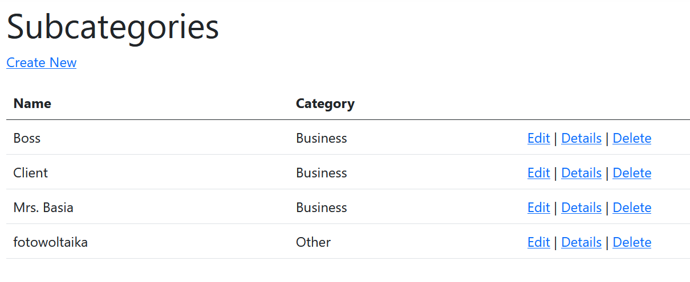
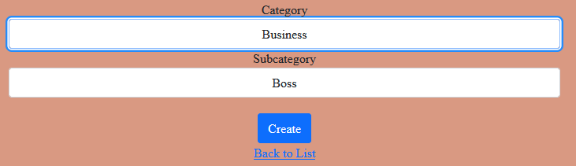

<h1>CrudContactListMvc</h1>
<h2>Create, read, update and delete contact list Model View Controller</h2>

<h1>Tags</h1>
REST API, CRUD, .NET Core, C#, Web App, Single Page Application, AJAX, Client–server model, JSON responses, POST, GET, SQL Server, all {contacts, categories and subcategorie} in the Database, Scaffolding in Visual Studio IDE, Razor Pages, Model View Controller (MVC), Entity Framework<br/>

<h1><a href="#quick_start">Qucik Start<a/><h1/>

<h1>Work Report - My feelings about this</h1>
<h2>time spent 12 days</h2>
<h2>overview</h2>
<p align="justify">
    It took me 12 days [full days, from 12AM to 3AM with some shopping & dinner few hour breaks] to bring this project to current state. This is my second client-server web application project. The previous one was made in python (<a href="https://github.com/Mateuszq28/insurance-cost-prediction">insurance-cost-prediction</a>). It took me some time to read up on .NET Entity Framework. I also tried to do this on a clean Razor pages, but it was like reinventing the wheel. I had some minor problems with linking @script{razor} pages tags to local scripts on .cshtml views with global wwwroot/js scripts when partially replacing html tags using AJAX technology without reloading the page. As a result of experiments, in the first attempt, a matryoshka with partial views was created. I put it in the "Single Page Application - matryoshka" tab. The second attempt simplified the architecture. Now, there is only one main site.js script for partial view switch controll. Views - .cshtml files based on Razor pages - are calling this main script in their body. In the simple view, there are 6 simple blocks and one multi-block [in future: <i>for each class. Classes blocks are distinguished by color set.</i>] Multiblock is located on the top of model class (ex. Contact) CRUD infrastructure. It has one div container for content &ltMODEL Class>_Multiblock_getIndex_content (ex. Contact_Multiblock_getIndex_content). All clicked button AJAX requests responses are anchored to this field. After obtaining answer from server, this answer is swapped with multiblock content container. Of course, the server answer is another form. As a result, multiblock is a self transforming form. It juggles partial views in its conent div. Other blocks doesn't have self-transformation ability. They have one depth grade - only one partial view.<br/>
        Other tabs on the header menu are classical (Controller) &lt--&gt (View Page) exchange interfaces to interact with the Database SQL Server.
</p>

<h2>Single Page Application subsite</h2>
<h2>Page Design</h2>
<br/>
<p align="center"><i>Multi-box (self-transforming) + 6 1-depth partial View boxes.</i></p><br/>

<h1>Source of Knowledge</h1>
<h2>Youtube Channel</h2>
Programming w/ Professor Sluiter<br/>
@shadsluiter<br/>
<h3>His movie about CRUD</h3>
<h4>(Create, read, update and delete)</h4>
<h4>ASP.NET Core Crash Course - C# App in One Hour</h4>
<a href="https://www.youtube.com/watch?v=BfEjDD8mWYg">https://www.youtube.com/watch?v=BfEjDD8mWYg</a><br/>
<h3>His playlist "ASP.NET Core Web Development"</h3>
<h4>(50 videos)</h4>
<a href="https://www.youtube.com/playlist?list=PLhPyEFL5u-i2ShGqmuP3uDdSy06hzBzdo">https://www.youtube.com/playlist?list=PLhPyEFL5u-i2ShGqmuP3uDdSy06hzBzdo</a><br/>
<h3>His movie about REST</h3>
<h4>(REpresentational State Transfer)</h4>
<a href="https://www.youtube.com/playlist?list=PLhPyEFL5u-i2ShGqmuP3uDdSy06hzBzdo">https://www.youtube.com/playlist?list=PLhPyEFL5u-i2ShGqmuP3uDdSy06hzBzdo</a><br/>

<h1>Architecture</h1>
<p>
    The app contains 4 type of different aproaches to make a web app.<br/>
    <ol>
        <li>Classical MVC - full page exchanging and reloading</li>
        <li>AJAX partial view exchanging with self-reference</li>
        <li>AJAX partial view exchanging with <b>no</b> self-reference</li>
        <li>REST API JSON exchange</li>
    </ol>
    In the future it is planned to transform REST API responses and paste obtain text elements into html tags.<br/>
</p>

<p align="center"><br/>
<i>Application menu bar</i></p><br/>
<p align="center"><br/>
<i>Model View Controler Architecture <a href="https://developer.mozilla.org/en-US/docs/Glossary/MVC">img source</a></i></p><br/>
<p align="center"><br/>
<i>Ajax Architecture <a href="https://www.w3schools.com/xml/ajax_intro.asp">img source</a></i></p><br/>
<p align="center"><br/>
<i>REST API response</i></p><br/>


<h1>Main Classes</h1>
<ul>
    <li>Models</li>
    <ul>
        <li>Contact</li>
        <li>Category - (of contact)</li>
        <li>Subcategory - (of Category)</li>
        <li>Simp - Contains Contact, Category, Subcategory</li>
        <li>Spa - Contains Contact, Category, Subcategory</li>
        <li>SeedData - initialze Database with default records</li>
    </ul>
    <li>Controllers - GET requestes and POST responses to the user interface (html site)</li>
    <ul>
        <li>CategoriesController</li>
        <li>ContactsController</li>
        <li>HomeController</li>
        <li>SimpsController</li>
        <li>SimpsControllerAPI</li>
        <li>SpasController</li>
        <li>SubcategoriesController</li>
    </ul>
</ul>
There are also Views - located in folders named the same as their corrsesponding models and controllers.<br/>
I also put some handy SQL queries in SQL_Test folder.<br/>

<h1>Database</h1>
<p align="justify">
    I used default Visual Studio Database server - SQL Server. I didn't have to create it from scratch. I used scaffolding. First, a migration was created with a Add-Migration InitialCreate command. Migration is a .Net class to generate database based on classes defined in Model folder. Then, command Update-Database apply Migration and create the Database. SQL table's definitions are accessible from Visual Studio manager. Some corrections are required. Ex. There is no [Unique] atribute in dotnet framework, that I used (.Net 8.0). I needed to apply SQL querry to secure uniqueness of email field. I could have used email as a primery key, but form my experience, it would bring a lot of problems and I would not recomend this.
</p>

<p align="center">
<br/>
<i>Contact Table</i><br/>
</p>

<p align="center">
<br/>
<i>Contact Table</i><br/>
</p>

<p align="center">
<br/>
<i>Subcategory Table</i><br/>
</p>

<h1>Features</h1>

<h2>Login</h2>

```csharp
[Authorize]
public IActionResult Contact_Create(IFormCollection form)
{
```

<p align="center">
<i>Using .Net Autorize attribute to acces to create form. This attribute is added not only on the GET view function, but also in function that add record to the database.</i><br/>
<i>[Attribute] in C# is an analogue to a @decorator in Python.</i><br/>
</p>

<p align="center">
<br/>
<i>Login Page</i><br/>
</p>

<h2>Viewing Contact List</h2>

<p align="center">
<br/>
<i>Contact List - Index</i><br/>
<i>Standard MVC View (Razor Page)</i><br/>
</p>

<p align="center">
<br/>
<i>Contact List - Index</i><br/>
<i>Single Page Application - partial view obtain from AJAX functionality</i><br/>
</p>

<p align="center">
<br/>
<i>Contact List - Index</i><br/>
<i>REST API capabilities presentation</i><br/>
<i>Server response received in JSON format</i><br/>
<i>It can be usd to fill independent html-json template.</i><br/>
<i>It can also be used for different kinds of application, ex. interconection with a smartphone app.</i><br/>
</p>

<h2>Viewing Category List</h2>

<p align="center">
<br/>
<i>Category List - Index</i><br/>
<i>Standard MVC View (Razor Page)</i><br/>
</p>

<h2>Viewing Subcategory List</h2>

<p align="center">
<br/>
<i>Subcategory List - Index</i><br/>
<i>Standard MVC View (Razor Page)</i><br/>
</p>

<h2>CRUD operations</h2>

<p align="center">
<br/>
<i>Details View</i><br/>
</p>

<p align="center">
<br/>
<i>Contact Edit</i><br/>
</p>

<p align="center">
<br/>
<i>Delete Confirmation</i><br/>
</p>

<h2>Create Operation</h2>

<p align="center">
<br/>
<i>Checking validation conditions in create form fields</i><br/>
</p>

<p align="center">
<br/>
<i>Subcategory - Business</i><br/>
</p>

<p align="center">
<br/>
<i>Subcategory - Private</i><br/>
</p>

<p align="center">
<br/>
<i>Subcategory - Other</i><br/>
</p>

```js
function CheckEmail()
{
    var emailInput = document.getElementById("emailInput");
    var emails = @Html.Raw(Json.Serialize(ViewBag.emails));
    if (emails.includes(emailInput.value))
    {
        emailInput.value = "This email is already in the Database."
    }

}
```

<p align="center">
<i>Email uniqueness condition in Java Script</i>
</p>

```sql
ALTER TABLE Contact
DROP COLUMN Email;

ALTER TABLE Contact
ADD Email NVARCHAR (320) UNIQUE NOT NULL;
```

<p align="center">
<i>Email uniqueness secure column in SQL Server</i>
</p>

<h1>Stuff to do - to finish the project</h1>
<ol>
    <li>the first row of buttons in simps/index does not work, e.g. details</li>
    <li>read "button fix in progress" commit</li>
    <li>copy the button name everywhere to "button" -> apply the fix to all buttons</li>
    <li>all functions in Sims Controller: input (value) -> input(form["val"])</li>
    <li></li>
    <li>{{4 buttons in Contact_Index (create, edit, details, delee) - repeat for all 3 classes _Index views}</li>
    <ul>
        <li>--- split by two commits - first html, then js}</li>
        <li>--- split by two commits - first create contact, then the rest three</li>
    </ul>
    <li>Notes</li>
    <ul>
        <li>multibox = multi-block</li>
        <li>multibox - only multibox + Index</li>
        <li>create view link create</li>
        <li>create view link create - only in multibox</li>
        <li>search 2 buttons - all 3 class index</li>
        <li>create 2 buttons - all 3 class index</li>
    </ul>
    <li></li>
    <li>all forms works</li>
    <li>switching between partial views also works</li>
    <li>multi-block works perfect</li>
    <li>&ltdiv class="Contact_Views">{All Contact blocks}&lt/div></li>
    <li>(2x (shift + alt + down arrow) {simps/index all Contact blocs} ) cast as [Category, Subcategory]</li>
    <li></li>
    <li>get server response in json format</li>
    <li>processor of responses in json format</li>
    <li></li>
    <li>try to fix all warnings!</li>
</ol>


<h1 id="quick_start">Quick Start<h1/>
<h2>Compilation and run notes</h2>

<p>It needs dotnet SDK to compile.
The easiest way to start is to install Visual Studio with .NET Core, Web module.</p><br/>

```shell
# open folder in terminal (write cmd + enter in File Explorer path field)
git clone git@github.com:Mateuszq28/CrudContactListMvc.git
cd CrudContactListMvc
dotnet build
cp -r wwwroot ./bin/Debug/net8.0/wwwroot
./bin/Debug/net8.0/CrudContactListMvc
# ctr+shift+t
explorer "http://localhost:5000/"
```

<h2>Alternative Command</h2>

```shell
dotnet run build
```

<h1>Code Statistics</h1>
<h2>Lines of Code</h2>

<i>To use popular linux commands on windows you can use cmder terminal.</i>

<h3>list all</h3>

```shell
git ls-files | xargs wc -l
```

83_778 Lines of code (most generated by Visual Studio)<br/>

<h3>list all self-written</h3>

```shell
git ls-files | xargs wc -l | grep -e ".*Models/.*" -e ".*Controllers/.*" -e ".*Views/.*" -e ".*wwwroot/js/site.js.*" -e ".*wwwroot/css/site.css.*" -e ".*SQL_Test/.*"
```

<h3>list by category</h3>

<b>Models</b><br/>

```shell
git ls-files | xargs wc -l | grep ".*Models/.*"
```

<b>Controllers</b><br/>

```shell
git ls-files | xargs wc -l | grep ".*Controllers/.*"
```

<b>Views</b><br/>

```shell
git ls-files | xargs wc -l | grep ".*Views/.*"
```

<b>wwwroot/js/site.js</b>

```shell
git ls-files | xargs wc -l | grep ".*wwwroot/js/site.js.*"
```

<b>wwwroot/css/site.css</b><br/>

```shell
git ls-files | xargs wc -l | grep ".*wwwroot/css/site.css.*"
```

<b>SQL_Test</b><br/>

```shell
git ls-files | xargs wc -l | grep ".*SQL_Test/.*"
```

<h4>list by category results</h4>

```shell
git ls-files | xargs wc -l | grep ".*Models/.*"
25 Models/Category.cs
66 Models/Contact.cs
9 Models/ErrorViewModel.cs
172 Models/SeedData.cs
15 Models/Simp.cs
15 Models/Spa.cs
22 Models/Subcategory.cs
315 TOTAL

git ls-files | xargs wc -l | grep ".*Controllers/.*"
172 Controllers/CategoriesController.cs
288 Controllers/ContactsController.cs
32 Controllers/HomeController.cs<
630 Controllers/SimpsController.cs
624 Controllers/SimpsControllerAPI.cs
316 Controllers/SpasController.cs
173 Controllers/SubcategoriesController.cs
1_611 TOTAL

git ls-files | xargs wc -l | grep ".*Views/.*"
33 Views/Categories/Create.cshtml
27 Views/Categories/Delete.cshtml
47 Views/Categories/Details.cshtml
34 Views/Categories/Edit.cshtml
35 Views/Categories/Index.cshtml
161 Views/Contacts/Create.cshtml
69 Views/Contacts/Delete.cshtml
72 Views/Contacts/Details.cshtml
69 Views/Contacts/Edit.cshtml
59 Views/Contacts/Index.cshtml
18 Views/Contacts/ShowSearchForm.cshtml
8 Views/Home/Index.cshtml
6 Views/Home/Privacy.cshtml
25 Views/Shared/Error.cshtml
68 Views/Shared/_Layout.cshtml
48 Views/Shared/_Layout.cshtml.css
26 Views/Shared/_LoginPartial.cshtml
2 Views/Shared/_ValidationScriptsPartial.cshtml
43 Views/Simps/Category_Create.cshtml
38 Views/Simps/Category_Delete.cshtml
58 Views/Simps/Category_Details.cshtml
46 Views/Simps/Category_Edit.cshtml
46 Views/Simps/Category_Index.cshtml
169 Views/Simps/Contact_Create.cshtml
79 Views/Simps/Contact_Delete.cshtml
83 Views/Simps/Contact_Details.cshtml
80 Views/Simps/Contact_Edit.cshtml
117 Views/Simps/Contact_Index.cshtml
29 Views/Simps/Contact_Search.cshtml
283 Views/Simps/Index.cshtml
49 Views/Simps/Subcategory_Create.cshtml
44 Views/Simps/Subcategory_Delete.cshtml
47 Views/Simps/Subcategory_Details.cshtml
50 Views/Simps/Subcategory_Edit.cshtml
52 Views/Simps/Subcategory_Index.cshtml
286 Views/Spas/Create.cshtml
69 Views/Spas/Delete.cshtml
72 Views/Spas/Details.cshtml
71 Views/Spas/Edit.cshtml
128 Views/Spas/Index.cshtml
174 Views/Spas/ShowContactIndex.cshtml
37 Views/Subcategories/Create.cshtml
33 Views/Subcategories/Delete.cshtml
36 Views/Subcategories/Details.cshtml
39 Views/Subcategories/Edit.cshtml
41 Views/Subcategories/Index.cshtml
3 Views/_ViewImports.cshtml
3 Views/_ViewStart.cshtml
2_931 TOTAL

git ls-files | xargs wc -l | grep ".*wwwroot/js/site.js.*"
239 wwwroot/js/site.js

git ls-files | xargs wc -l | grep ".*wwwroot/css/site.css.*"
29 wwwroot/css/site.css

git ls-files | xargs wc -l | grep ".*SQL_Test/.*"
28 SQL_Test/add_ferign_key.sql
10 SQL_Test/add_key_category.sql
24 SQL_Test/add_unique_email.sql
6 SQL_Test/delete_all.sql
8 SQL_Test/foreign_keys.txt
6 SQL_Test/reset_id_numeration.sql
2 SQL_Test/select_all.sql
15 SQL_Test/test_add.sql
99 TOTAL
```

<p><b>5_224</b> TOTALS TOTAL LINES OF CODE (self-written with scaffolding help)<br/>
Scaffolding items required modification, so 5_224 lines of code statistic is fair enough.</p>


<footer>
<h3>Footer</h3>
Author: Mateusz Miler<br/>
Code from: <a href="https://github.com/Mateuszq28/CrudContactListMvc">https://github.com/Mateuszq28/CrudContactListMvc</a><br/>
Discussion about line counting methodology <i>(with git ls-files): </i> <a href="https://stackoverflow.com/questions/4822471/count-number-of-lines-in-a-git-repository">https://stackoverflow.com/questions/4822471/count-number-of-lines-in-a-git-repository</a><br/>
<i>(with find): </i><a href="https://stackoverflow.com/questions/1358540/how-can-i-count-all-the-lines-of-code-in-a-directory-recursively">https://stackoverflow.com/questions/1358540/how-can-i-count-all-the-lines-of-code-in-a-directory-recursively</a><br/>
</footer>